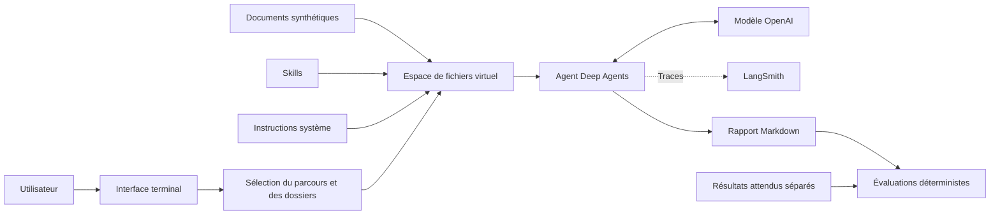

# Architecture actuelle

## Vue d’ensemble

## Flux d’exécution

1. L’utilisateur choisit l’un des trois parcours dans le terminal.
2. L’application charge uniquement les documents nécessaires.
3. Les documents, instructions et skills sont placés dans un espace virtuel.
4. L’agent consulte le skill correspondant et analyse les sources.
5. Le rapport produit est enregistré dans `outputs/`.
6. Les évaluations vérifient les faits, les citations et certains comportements interdits.

## Décisions actuelles

- Un agent unique sert de baseline avant toute architecture multi-agent.
- Les petits corpus Markdown sont lus directement, sans RAG.
- Les résultats attendus des évaluations ne sont jamais transmis à l’agent.
- La décision finale de répondre à une consultation reste humaine.
- Les données métier sont entièrement fictives.